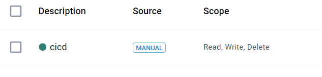
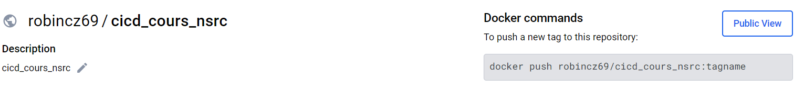
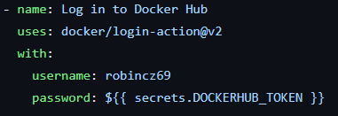
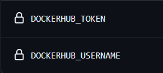

# README pour le Projet

## À propos du Projet

Ce projet utilise GitHub Actions pour automatiser les processus d'intégration continue (CI) et de livraison continue (CD). Les workflows définis dans `.github/workflows` assurent une qualité de code constante et facilitent le déploiement de nouvelles versions.

## Intégration Continue (CI)

### Workflow CI

Le fichier `ci.yml` déclenche le processus d'intégration continue,  sur chaque pull request vers la branche `master`.

#### Étapes du CI :

1. **Checkout du code** : Récupération du dernier état du code sur la branche concernée.
2. **Configuration de l'environnement PHP** : Utilisation de PHP 8.2.
3. **Installation des dépendances** : Installation des packages nécessaires via Composer.
4. **Exécution des tests** : Lancement des tests unitaires avec PHPUnit.

### Commandes pour Exécuter Localement le CI

Pour reproduire le CI localement, exécutez les commandes suivantes :

git checkout votre-branche
composer install
./vendor/bin/phpunit

Assurez-vous que PHP 8.2 est installé sur votre machine.

## Livraison Continue (CD)

### Workflow CD

Le fichier `cd.yml` gère le déploiement continu, déclenché lorsqu'un tag est poussé sur le dépôt.

#### Étapes du CD :

1. **Checkout du code** : Récupération du code basé sur le tag poussé.
2. **Création d'une Release GitHub** : Automatisation de la création d'une release GitHub avec les détails du tag.

### Livrable du CD

Le livrable principal de ce processus de CD est une **Release GitHub** contenant le code source. 

### DockerHub

Une branche ``dockerfile`` permettant la mise en place d'une routine cd a été mise en place.

Celle-ci doit permettre de pouvoir push le projet dans un dockerhub ``robincz69/cicd_cours_nsrc``, accessible via token. 

Les tokens sont accesible directement via les secrets github. (le nom à été push en dur pour les tests )

Cependant, une erreur de crédential continue d'etre bloquante. A noté que l'image est fonctionnel en local, nous enb resteront la.
(le pb pouvant venir également de nos connexion, car nous passons par des vpn).

## Guide pour le stagiaire

### Déploiement d'une Nouvelle Version

Pour déployer une nouvelle version de l'application pendant nos congés, suivez ces étapes :

1. **Vérification du Code** : Assurez-vous que le code sur la branche `master` est stable et prêt pour une nouvelle release.
2. **Création d'un Tag** : Créez un tag pour la nouvelle version. Par exemple, pour créer un tag `v1.0.12`, utilisez :

git tag v1.0.12
git push origin v1.0.12

3. **Vérification du Workflow CD** : Allez dans l'onglet "Actions" du dépôt GitHub pour vérifier que le workflow CD s'est exécuté avec succès.
4. **Consultation de la Release** : Une fois le workflow terminé, une nouvelle release sera disponible sous l'onglet "Releases" du dépôt GitHub.